#  Transfer Learning and Comparison of Different Learning Methods
### 50.021 Transfer Learning
## Fine Tunning of Neural Networks
Aim is to retrain the resnet18 to just classify input image to two different classes, Outdoor and indoor images.
##### 3 Different types of transfer learn that will be compared
A. Resnet18 without pre-loading weights and training all layers.  
B. Resnet 18 loading the model weights and training all layers.  
C. Resnet 18 loading model weights before training and training only the last trainable layer.  

## Coursework Materials

###  Includes:
1. Using Imageclef2011 Images
2. Labels in concepts_2011.txt

### Deliverables
1. Train and compare the performace between A,B,C types of transfer learning.
2. Plot the Training loss and Accuracy vs Apoch
3. Plot the Validation Loss and Accuracy vs Epoch

#### Model Hyperparameters and Learning strategy
1. Stochastic Gradient Descent with Learning Rate = 1e-3, Momentum=0.9
2. Cosine Annealing Warm Restarts for variable learning rates, T_max = 10 

#### Data Augmentation Options For learning step
1. Single random crop 
2. Five crop

  <strong>[A]Resnet18 without pre-loading weights and training all layers</strong>
    

    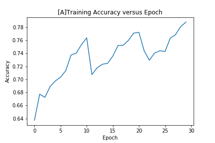
    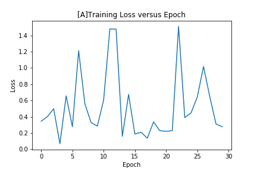

    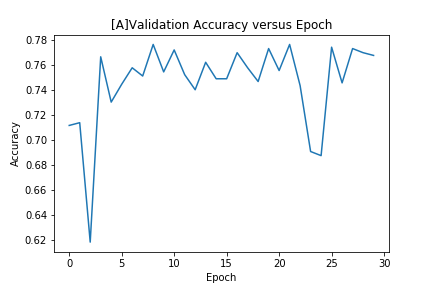
    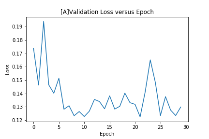

  <i> 
    [Best Epoch] Validation Loss: 0.12245642230717918   
    [Best Epoch] Validation Accuracy: 0.7766776677667767  
    Test Loss: 0.13011215202379645  
    Test Accuracy: 0.7905701754385965  
  </i>
    

    

  <strong>[B]Resnet 18 loading the model weights and training all layers</strong>
    

    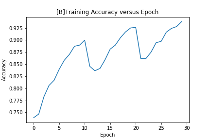
    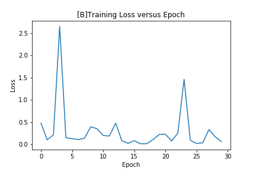

    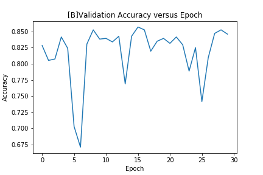
    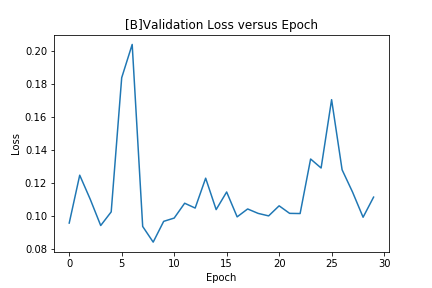

  <i> 
[Best Epoch] Validation Loss: : 0.09365081723996646  
[Best Epoch] Validation Accuracy: 0.8305830583058306  
Test Loss: 0.09465956211645614  
Test Accuracy: 0.8508771929824561  
  </i>
    

    

  <strong>[C]Resnet 18 loading model weights before training and training only the last trainable layer</strong>
    

    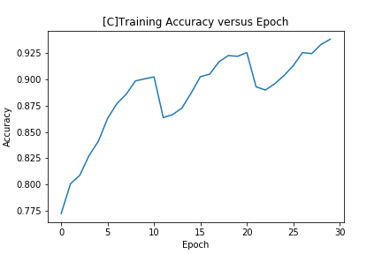
    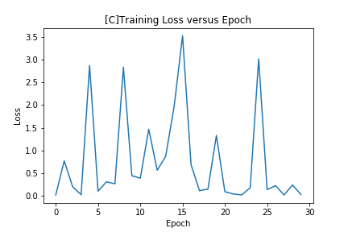

    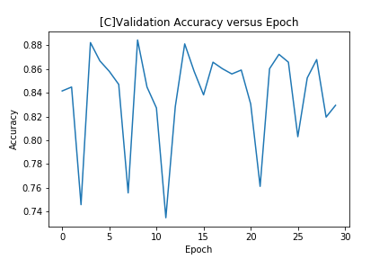
    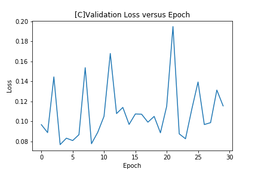

  <i> 
    [Best Epoch] Validation Loss:0.07681695472682663  
    [Best Epoch] Validation Accuracy:0.8822882288228823  
    Test Loss:0.07930669003868834  
    Test Accuracy:0.8804824561403509  
  </i>
    

## Built With
* [Pytorch](https://pytorch.org/) - An open source deep learning platform that provides a seamless path from research prototyping to production deployment.
* [imageclef2011](https://www.imageclef.org/) - ImageCLEF aims to provide an evaluation forum for the cross–language annotation and retrieval of images.

## Authors
* Zenger Soong Cun Yuan

